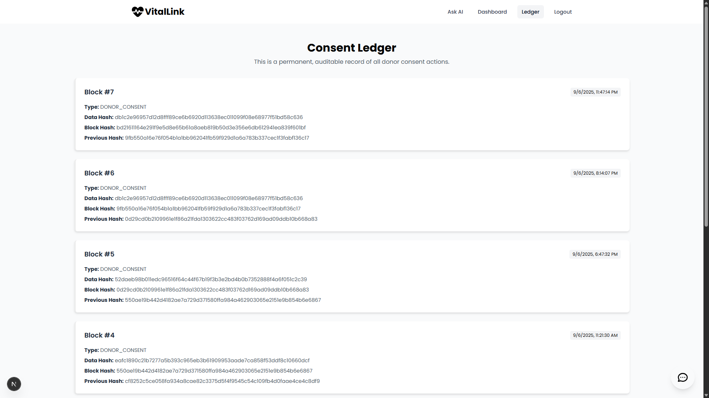

# VitalLink: Modern Organ Donation Platform

Welcome to **VitalLink**, a full-stack web application designed to modernize and rebuild trust in the organ donation process. This project leverages a modern technology stack—including Next.js, AI, and blockchain principles—to create a transparent, efficient, and secure platform for donors, patients, and medical professionals.

---

## 🚀 Demo & Screenshots

> **Live Demo:** _Coming soon!_

### Landing Page


### Registration Flow


### Donor Dashboard


### Admin Dashboard


### Medical Professional Portal


### Blockchain Transparency Portal




### RAG based AI Portal


---

## Features

VitalLink is more than just a registration form; it's a complete ecosystem with features tailored to each user role.

### For Everyone

- **AI-Powered Assistant:** Site-wide conversational AI chatbot (powered by Google Gemini) trained with a RAG pipeline to answer questions about the platform and organ donation.
- **Professional & Responsive UI:** Clean, modern, and calming interface built with Tailwind CSS, accessible on any device.
- **Secure Authentication:** Robust user registration with OTP email verification for valid and secure accounts.

### For Donors

- **Seamless Registration:** Easy-to-use registration flow with secure OTP email verification.
- **Personalized Dashboard:** Manage your detailed profile, including blood type, address, and organ preferences.
- **Donation Pledge:** Specify donation preferences (after death or as a living donor).
- **Digital Donor ID Card:** Downloadable, digital ID card confirming your life-saving pledge.

### For Medical Professionals

- **Secure Portal:** Role-protected dashboard accessible only to verified medical staff.
- **Donor Verification Workflow:** Review and approve new donor registrations, moving them from "Pending" to "Verified" status.
- **Patient Registry:** Add and manage a list of patients (recipients) in need of transplants, linked to their hospital.
- **Intelligent Matching Engine:** Find potential donor matches for a specific patient based on organ needed and blood type compatibility.

### For Administrators

- **Centralized User Management:** Secure admin dashboard to view and manage all users (Donors, Medical Professionals, Admins).
- **System Oversight:** Monitor platform activity and ensure integrity.

### The Trust Layer

- **Simulated Blockchain Ledger:** Critical actions (like donor consent) are recorded as transactions on a simulated, immutable ledger.
- **Transparency Portal:** Authorized users can view the entire chain of consent transactions, providing an auditable and transparent history.

---

## Tech Stack

- **Framework:** Next.js 14 (App Router)
- **Language:** TypeScript
- **Database:** PostgreSQL (with SQLite for local development)
- **ORM:** Prisma
- **Authentication:** NextAuth.js (JWTs) & OTP Verification
- **Styling:** Tailwind CSS
- **AI Engine:** Google Gemini via the Vercel AI SDK
- **Email:** Nodemailer (with Ethereal for development)
- **UI Components:** Headless UI & Custom Components
- **Notifications:** React Hot Toast
- **Deployment:** Vercel (planned)

---

## Getting Started

### Prerequisites

- Node.js (v18.0 or higher recommended)
- Git

### Installation & Setup

1. **Clone the repository:**
   ```sh
   git clone https://github.com/Srizdebnath/Vitallink_main
   cd vitallink-web
   ```

2. **Install NPM packages:**
   ```sh
   npm install
   ```

3. **Set up your environment variables:**
   - Create a copy of the example environment file:
     ```sh
     cp .env.example .env.local
     ```
   - Open `.env.local` and fill in the required variables:
     - `DATABASE_URL`: Default is set up for SQLite and should work out of the box.
     - `JWT_SECRET`: Generate a long, random string for signing tokens.
     - `GOOGLE_GENERATIVE_AI_API_KEY`: Your API key from Google AI Studio.

4. **Set up the database:**
   - Run the Prisma migration to create your local SQLite database and its tables.
     ```sh
     npx prisma migrate dev
     ```

5. **Run the development server:**
   ```sh
   npm run dev
   ```
   - Open [http://localhost:3000](http://localhost:3000) in your browser to see the result.

#### Useful Prisma Commands

- **View and edit your local database:**
  ```sh
  npx prisma studio
  ```
- **Generate the Prisma Client after schema changes:**
  ```sh
  npx prisma generate
  ```

---

## Project Roadmap

While the current version is a feature-rich MVP, here are the planned next steps:

- **Deployment:** Migrate to a production PostgreSQL database (Supabase) and deploy to Vercel.
- **Real-time Notifications:** Implement WebSockets for instant alerts (e.g., when a potential match is found).
- **Mobile Application:** Develop a companion mobile app using React Native for on-the-go access for medical professionals.
- **Full Blockchain Integration:** Replace the simulated ledger with a connection to a real private blockchain network like Hyperledger Fabric.

---

## Contributing

Contributions, issues, and feature requests are welcome! Feel free to check the issues page.

---

## Acknowledgments

A huge thank you to our mentors for their guidance and support. Inspiration from the open-source community.

---
